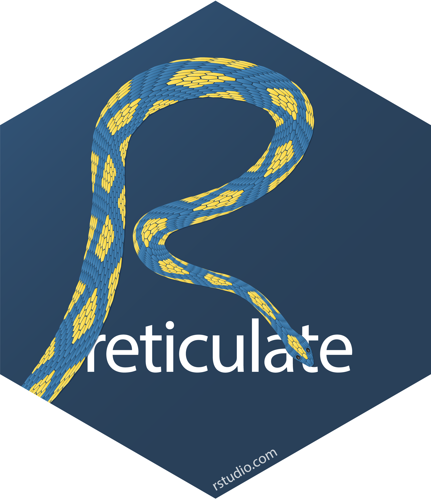

```{r setup, include=FALSE}
options(htmltools.dir.version = FALSE)
library(fontawesome)
```

```{r xaringan-themer, include=FALSE, warning=FALSE}
library(xaringanthemer)
style_xaringan(
  background_color = '#000000',
  text_color = '#FFFFFF',
  text_font_family = 'Montserrat Alternates',
  header_color = '#FFFFFF',
  header_font_family = "Source Sans Pro",
  code_font_family = "IBM Plex Mono",
  code_inline_color = "#ffa600",
  code_font_size = "0.6em",
  text_slide_number_color = "#b6bfc2",
  extra_fonts = list(
    google_font(family = "Source Sans Pro"),
    google_font(family = "Signika"),
    google_font(family = "Montserrat Alternates"),
    google_font(family = "IBM Plex Mono"),
    google_font(family = "Lemonada")
  ),
  extra_css = list(
    ".fancy" = list("font-family" = "Signika"),
    ".large" = list("font-family" = "Source Sans Pro"),
    "img.circle" = list('border-radius' = '50%'),
    "h3" = list("font-family" = 'Source Sans Pro'),
    "img.center" = list("margin-left" = "auto", "margin-right" = "auto"),
    ".remark-slide-number" = list('opacity' = 0L)
  )
)
```

name: xaringan-title
class: left, middle
background-image: url(img/brooke-lark-unsplash.jpg)
background-size: cover

# Reticulate



### .fancy[Using the best of <br /> Python in R]

### .large[Nik Agarwal | 2021-03-24]

---
class: right, middle


# Find me at...

[`r fa(name = 'twitter', fill = 'steelblue')` @nikagarwal](https://twitter.com/nikagarwal)  
[`r fa(name = 'github', fill = 'steelblue')` @nikdata](https://github.com/nikdata)  
[`r fa(name = 'link', fill = 'steelblue')` Blog](https://nik.netlify.app)  
[`r fa(name = 'paper-plane', fill = 'steelblue')` gitnik@niks.me](mailto:gitnik@niks.me)  

---

# About Me

### `r fa(name = 'jedi-order', fill = 'steelblue')` Principal Data Scientist at MakuSafe

### `r fa(name = 'calendar-alt', fill = 'steelblue')` 12+ years in manufacturing, warehousing, data science

### `r fa(name = 'graduation-cap', fill = 'steelblue')` M.S. in Data Science from [Northwestern](https://www.northwestern.edu)

### `r fa(name = 'graduation-cap', fill = 'steelblue')` B.S. in IE from [NIU](https://www.niu.edu)

---

# About MakuSafe

### `r fa(name = 'building', fill = 'steelblue')` Startup based in West Des Moines

### `r fa(name = 'mobile-alt', fill = 'steelblue')` Wearable tech focusing on worker safety

### `r fa(name = 'chart-line', fill = 'steelblue')` Solution consists of hardware, software, and data

**MākuSafe is a wearable technology solution designed to improve worker safety and reduce accidents in the workplace**

---

# What sets us apart

* No personal biometric data collected

* No disruption to wearer (i.e., no visual, auditory, or haptic feedback)

* No continuous monitoring (i.e., device only activates when it senses hazards)

* We focus exclusively on the environment around a worker and not just the worker


---
exclude: true

# Fast Growth


---

# MakuSafe Wearable


---
class: middle, inverse

# What's on tap today?

--

### `r fa(name = 'wpexplorer', fill = 'steelblue')` What led me to Reticulate

--

### `r fa(name = 'code', fill = 'steelblue')` Difference between python & reticulate syntax

--

### `r fa(name = 'laptop', fill = 'steelblue')` Reticulate in action

---
class: middle, inverse

# What does {reticulate} do?

--

### `r fa(name = 'phone-alt', fill = 'steelblue')` Call Python from R  

--
 
### `r fa(name = 'language', fill = 'steelblue')` Translate R & Python objects between each other  

---

# Why Reticulate

--

No good IDE for Python

Parallel processing in R isn't great

--

.pull-left[

## `r fa(name = 'heart-broken', fill = 'steelblue')` Python

- #### data wrangling is not fun

- #### making plots is a disaster

]

--

.pull-right[

## `r fa(name = 'heart', fill = 'steelblue')` Python

- #### scikit-learn is awesome!
- #### deep learning!
- #### some libraries are more powerful (e.g., SMOTE, JSON)

]

---

# One stop shop

With {reticulate} I get one IDE (RStudio) for 2 languages:

#### `r fa(name = 'broom', fill = 'steelblue')` data wrangling with R

#### `r fa(name = 'chart-bar', fill = 'steelblue')` plotting with R

#### `r fa(name = 'flask', fill = 'steelblue')` data modeling with Python using R objects

####`r fa(name = 'docker', fill = 'steelblue')`deployment in Docker with both R & Python

---

# Syntax Comparisons

## Importing libraries

.pull-left[

### Python

```python
import pandas as pd
```

]

.pull-right[

### R

```r
pd <- reticulate::import(pandas)
```

]
---
# Syntax Comparisons

## Read in CSV

.pull-left[

### Python

```python
df = pd.read_csv(<file>)
```

]

.pull-right[

### R

```r
df = pd$read_csv(<file>)
```

]

- The '$' operator in R allows you to access components within an object

---

# There has to be a catch...

Reticulate may not work with all python package versions.

Small hit to performance & memory.

I have not run into any significant issues. Just quirks (see "Demo").

---
class: middle, inverse

# Demo

---

# Step 1: Load CSV using Pandas

```{r, warning=FALSE, message=FALSE}
library(reticulate)
library(dplyr)

pd <- reticulate::import("pandas")
df <- pd$read_csv("penguins.csv")

dplyr::glimpse(df)
```
---

# Step 1A: Replace NaN with NA

We should replace `NaN` with `NA`

```{r}
df <- df %>%
  dplyr::mutate(
    across(.cols = everything(), .fns = ~ ifelse(.x == 'NaN',NA,.x))
  )

dplyr::glimpse(df)
```


---

# Step 1B: Unlist Gender


We should "fix" the `gender` column (from list to string/character)

```{r}
df <- df %>%
  dplyr::mutate(
    gender = unlist(gender)
  )

dplyr::glimpse(df)
```

### Everything looks good!

---

# Step 2: Plotting

```{r warning=FALSE, message=FALSE, out.width='300px'}
library(ggplot2)

df %>%
  ggplot(aes(x = bill_length_mm, y = body_mass_g, color = species)) +
  geom_point() +
  labs(x = "Bill Length (mm)", y = "Body Mass (g)", color = "Species")
```


---

# My Suggestions

#### `r fa(name = 'wrench', fill = 'steelblue')` Keep Python packages up to date

#### `r fa(name = 'r-project', fill = 'steelblue')` Use native R functions often

#### `r fa(name = 'file', fill = 'steelblue')` Check the RStudio Docs - very detailed

#### `r fa(name = 'exclamation-triangle', fill = 'steelblue')` Check the "Environment" tab in RStudio


---

# Looking for a longer example?

### `r fa(name = 'binoculars', fill = 'steelblue')` [Example Gist](https://gist.github.com/nikdata/ce4c72550f184e6bc20d6c98475e5a5d)

I make use of {recipes}, scikit-learn, SMOTE, and more!

---
class: middle

# Happy Coding!
